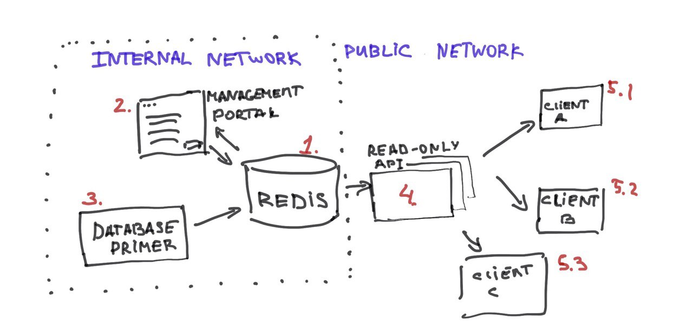

dynamic-config
====


### Project overview 

`DynamicConfig.Configuration` library aims to provide an abstraction over the configuration management system. It provides the 'hot' settings reload without a need to redeploy or restart an application.

This repository consists of a few packages: 

* `DynamicConfig.Configuration` is a client library which manages a local cache of settings for the given service
* `DynamicConfig.Storage.Api` is a .NET Core Web API project which provides an http interface for the Configuration lib. It seres and up-to-date configuration state stored in a central redis db.
* `DynamicConfig.Management.Web` is a configuration management portal, which provides standard CRUD operations to the settings set.
* `clients/DatabasePrimer.Service` a side-car service for the `DynamicConfig.Management.Web` project. It's only goal is to insert some configs, to solve the cold start problem. (for the demo purpose it just inserts some random keys/values to the db)
* `clients/WorkerService.ServiceA` is an example client application with is using the `DynamicConfig.Configuration` lib to keep its settings up to date.

### How to build/test

Make sure you have .NET Core 3.1 SDK installed.

Navigate to the repo root and run: 

```
dotnet build
dotnet test
```

and enjoy :)

### How to see it in action

Make sure you have Docker installed.

Navigate to the repo root and run: 

```
docker-compose build
docker-compose up (-d)
```

this will bring up the following system: 




There will be two networks spined up :`internal` and `public`.

In a private network you will find three services: 

1. `dynamic-config-redis-storage` a Redis service
2. `dynamic-config-management-web` a management portal which enables you to perform CRUD operations on your settings set.
3. `dynamic-config-database-primer` a service which seeds an initial data and randomly adds keys to DB

In a public network you have following services available: 

4. `dynamic-config-storage-api` a read-only api which provides clients with an up-to-date configuration. Could be scaled individually depends on the load. 
5. `client-service-a` a service which uses a `DynamicConfig.Configuration` library to access it's settings.

the management portal should be available on : 

`http://0.0.0.0:8081`

Make sure to take a look at logs (either run `docker compose up` without `-d` key, or log in to a container and check it's logs (`docker ps` `docker logs`), or use you Docker Desktop UI tool, whatever floats your boat.). You will notice how the DatabasePrimer puts new settings key to the DB, how ServiceA tries to refresh its settings and how Storage.Api services an updated keys set.